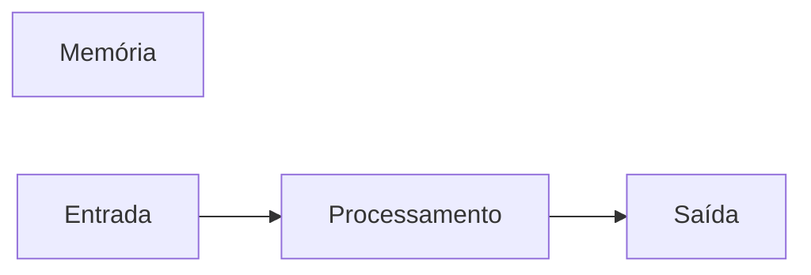

# JavaScript
Repositório usado para estudo de lógica de programação com uso da linguagem JavaScript.
## Autor
Fabricio Paixão

---
## Variáveis
Variáveis são espaços na memória do computador, usados para guardar valores que podem alterar ao longo do programa.
### Principais tipos primitivos
- string (texto)
- number (números)
- boolean (true or false)

---
## Operadores Aritméticos
| Operador | Propósito | Exemplos | Resultado |
|----------|-----------|----------|-----------|
| = | Atribuir um valor | x = 10 | x = 10 |
| + | Somar | 10 + 5 | 15 |
| += | Somar e Atribuir | x += 5 | x = 15 |
