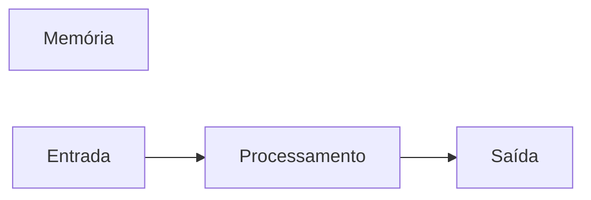

# JavaScript
Repositório usado para estudo de lógica de programação com uso da linguagem JavaScript.
## Autor
Fabricio Paixão

---
## Variáveis
Variáveis são espaços na memória do computador, usados para guardar valores que podem alterar ao longo do programa.
### Principais tipos primitivos
- string (texto)
- number (números)
- boolean (true or false)



---
## Operadores Aritméticos
| Operador | Propósito | Exemplos | Resultado |
|----------|-----------|----------|-----------|
| = | Atribuir um valor | x = 10 | x = 10 |
| + | Somar | 10 + 5 | 15 |
| += | Somar e Atribuir | x += 5 | x = 15 |
| - | Subtrair | 15 - 10 | 5 |
| -= | Subtrair e Atribuir | x -= 10 | x = 5 |
| * | Multiplicação | 5 * 4 | 20 |
| *= | Multiplicar e Atribuir | x *= 4 | x = 20 |
| / | Divisão | 20 / 2 | 10 |
| /= | Dividir e Atribuir | x /= 2 | x = 10 |
| ++ | Somar 1 ao resultado | x++ | 11 |
| -- | Subtrair 1 do resultado | x-- | 10 |
| % | Resto da divisão | 10 % 3 | 1 |

---
## Operadores Lógicos
| Operador | Simbologia | 
|----------|-----------|
| AND | && |
| OR | \|\|  |
| NOT | ! |

---

## Comparadores

| Comparador | Significado |
|----------|-----------|
|  > |  Maior que  |
| >= | Maior ou igual a |
| < | Menor que |
| <= | Menor igual a |
| === | Idêntico a |
| !== | Não idêntico a |

---

## Estruturas de Controle
### Estrutura de Controle Condicionais

```javascript
if (condição){
  // condição verdadeira
}

if (condição){
  //condição verdadeira
} else {
  // condição falsa
}

if (condição 1){
  //condição 1 verdadeira
} else if (condição 2){
  //condição 2 verdadeira
} else {
  // se nenhuma das condições anteriores for verdadeira
}

switch (valor) {
  case 1:
    //código caso o valor seja 1
    break
  case 2:
    //código caso o valor seja 2
    break 
  default:
    //código caso o valor seja diferente 1 ou 2
    break
}
 
```
